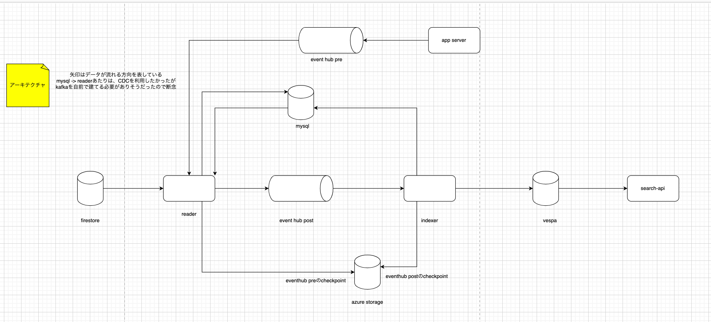

# micce-engine-vespa

検索エンジン前段のsearch-apiと検索エンジンmicce-vespaを格納するリポジトリ

## search-api

- app-serverからのリクエストを受け取ってレスポンスを返す
- micce-vespaに対して検索をかける
- シノニム辞書メモリに持っておいて（プロセス起動時にメモリに展開する）、リクエストテキストをシノニム展開し、ORクエリを構築する
  - ネットにいい感じのシノニム辞書っぽいものがないか探す
  - なければ地道に自分たちで作成する

### 仕様

前段APIからのリクエストは
- id,name,koreaName,category,hasInstagramImages,lat,lon,limit,offset
- nameとkoreaNameとlat,lonで検索をかける


### TODO（要検討・後々追加する機能）
- 「ウェルビー名駅店」など検索エンジンには存在しないspotをどう判断するか検索エンジン側の仕組みで考える


## search-engine
- スポットのid, nameを格納する検索エンジン
- nameはインデクシング時・検索時に日本語tokenizeする
  - 日本語トークナイザーはデフォルトでvespaには実装されていないのでプラグインとして↓を利用する
  - https://github.com/yahoojapan/vespa-kuromoji-linguistics

### vespa立ち上げ・デプロイ

```shell

$ docker compose up -d

$ cd search-engine

$ ./package.sh local

$ cd target
# デプロイできるか確認
$ vespa status deploy --wait 300

# 実際にデプロイ
# search-engine配下のファイル群をデプロイ
$ vespa deploy --wait 300 ./
```

### 検索
```shell
curl -i -X POST \
   -H "Content-Type:application/json" \
   -d \
'{
  "yql": "select * from spot where true"
}' \
 'http://localhost:8080/search/'
```


## システムアーキテクチャ




## mysqlマイグレーション

- 利用ツール
ddlだけ作っておいてそのファイルを編集していけば自動で差分検知しマイグレーションを行なってくれる
https://github.com/sqldef/sqldef

- ローカル
```shell
$ mysqldef --user=root --host=127.0.0.1 micceSearchEngine < rdbms-schema/ddl.sql
```

変更差分だけ表示したい場合
```shell
mysqldef --user=root --host=127.0.0.1 --dry-run micceSearchEngine < rdbms-schema/ddl.sql
```


## 本番firestoreのデータをeventhub-preに流し込む作業

```shell
$ cd tools
$ poetry install
$ poetry run python insert_spot.py
```

## search-apiのインターフェース定義書

openapi定義書があるのでそちらを参照
docker composeでswagger-uiを立ち上げて

```shell
$ open http://localhost:8002
```
